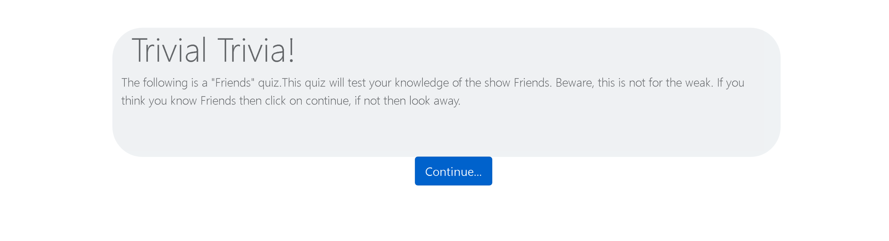
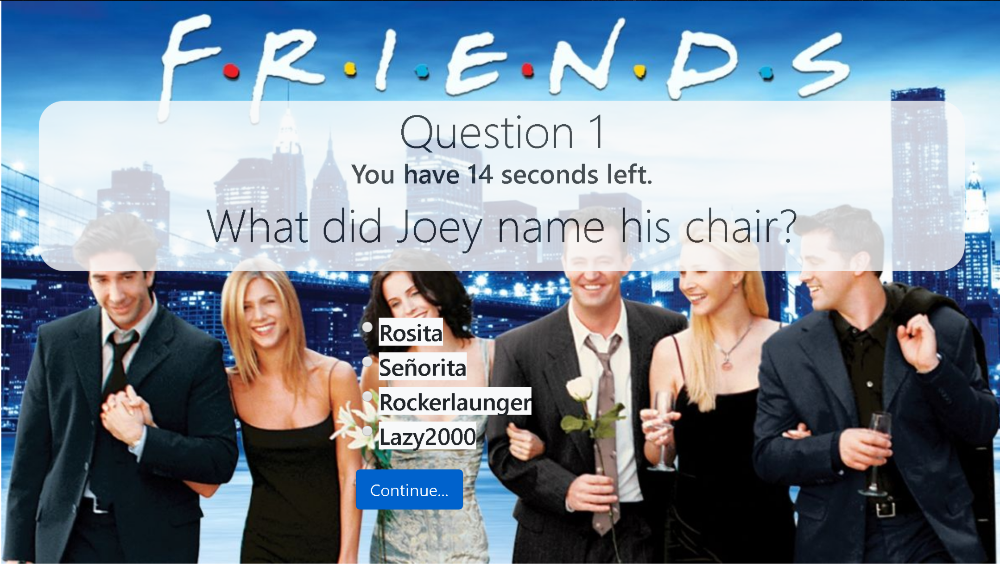

# TriviaGame
## Introduction
This game was created using javascript. Moreover, we seeked to practice using timeouts and time intervals. We used bootraps as well to style the front end. 

## Instructions

This is a simple trivia game with 10 questions. The question are base on the 90's sitcom "Friends". The Scoring will consist on correctly, incorrectly and unanswer questions. Regardless of correctness after answering or ignoring a quesiton a gif will be display. 

## Tech used

We utilize the set time out functions to keep record of time. We started a counter at 15 and created an function that decrease the counter to 0 every 1000 ms. In other to update the divs with the next question, we use *jquery* targeting and manipulation of divs (html, append, and text functions). Framework is achive through *bootstrap*. For event listeners we used jquery click function. Code is *modularize* into functions.

## Future Developments

* Creating a datebase of questions.
* Creating user for the site. 
* Creating categories for different theme questions.
* Creatig a chat room for users. 

## Examples

